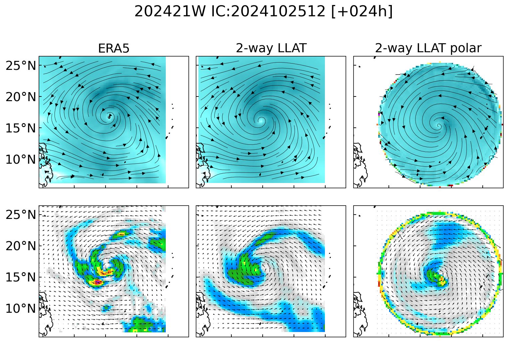
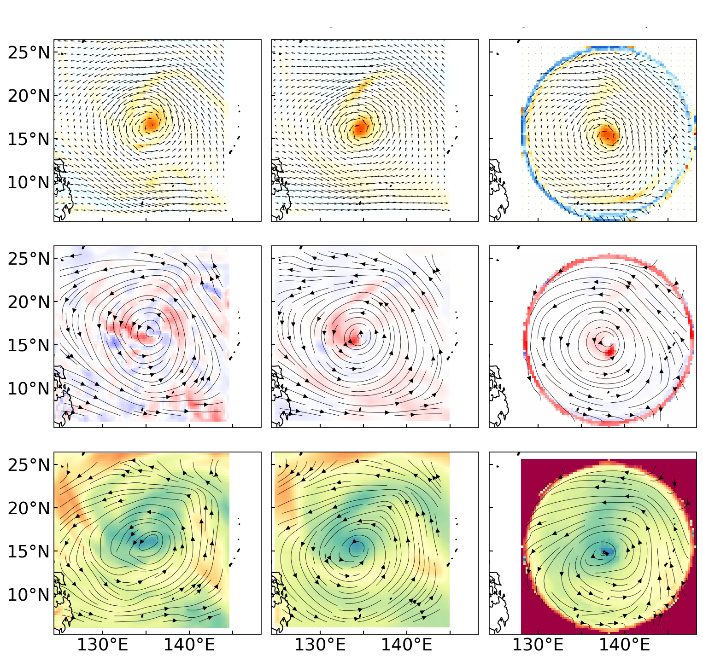
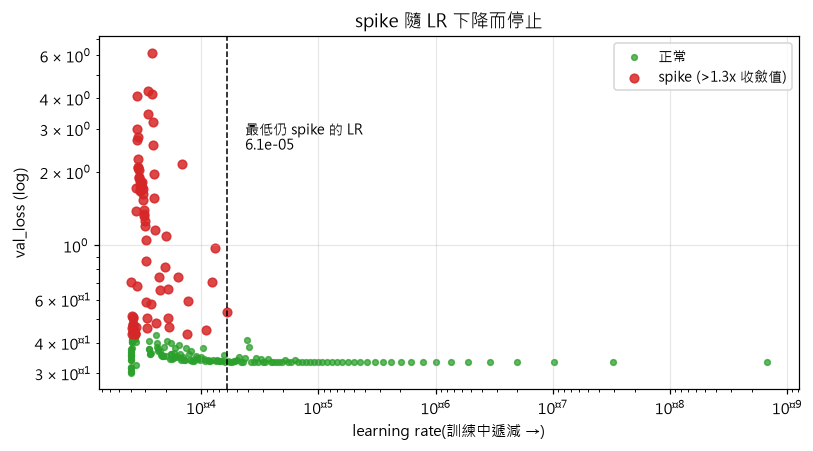
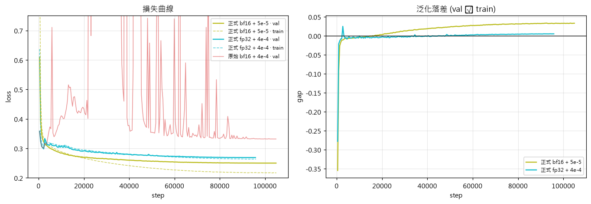
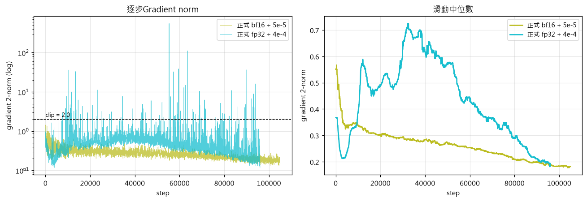

# DLAMP.ty 

### 進度報告 — 2026-08-05

**目標**

1. **降低運算量**
2. **增加對颱風內核的關注度**
3. **未來針對高解析資料做fine-tune**

**做法**:把模式從笛卡兒 (lat, lon) 網格改成 **TC 中心極座標 (r, θ)**

## 1 · 極座標網格

#### 推論

- 極座標圓只涵蓋 **78.5%**, **21.5% 被填 0**

#### 初步結果(r=0.05°)

- 初步實驗結果不佳 —— 極座標欄(右)最外圈出現壞值

#### 初步結果(r=0.05°)—— 續

## 2 · 目前切法

| | 笛卡兒 | r=0.05° | **r=0.25°(本次)** |
|---|---|---|---|
| 網格 | 81 × 81 | 201 × 180 | **41 × 180** |
| 徑向間距 Δr | 0.25°(等向) | **0.05°** | **0.25°** |
| 方位間距 Δθ | — | 2° | 2° |
| window shape | [2, 4, 4] | [2, 10, 15]&[2,  8, 10] | [2, 10, 15]&[2,  8, 10] |
| patch shape | [2, 4, 4] | [2, 8, 6] | [2, 8, 6] |

- window size/patch size須依據網格切法調整(還沒調)
- 未來考慮**增加 r 解析度、降低 θ 解析度**(e.g. Δr=0.105°, Δθ = 3°)

## 3 · 目前訓練配置

| | r=0.05° 版 | **本次(r=0.25°)** |
|---|---|---|
| GPU | 4 張 | **8 張 H200** |
| 每卡 batch | 1 | **4** |
| 精度 | fp32 | **實驗中** |
| 峰值學習率 | 4e-4 | **實驗中** |
| warmup | 1,000 步 | 1,000 步 |
| 梯度裁剪 | 2.0 | 2.0 |
| `max_steps` | 1,600,000 | 105,000 |
| 實跑步數 | 252,160(**15.8%**) | **104,979(100%)** |
| 高空變數(× 13 層) | u, v, t, q, z, w | **vt, vr**, t, q, z, w |
| 地面變數 | u10, v10 + 其他(16個) | **vt10, vr10** + 其他(16個) |
| 總時數 | X | **6.7 小時** |

- 變數表**只差風的表示法**(笛卡兒 u/v → 極座標切向/徑向 vt/vr),

#### 效能: 估計Throughput 提升 80×

- 每 epoch **2.85 小時 → 2.1 分鐘**

## 4 · Bug 修正

**問題** — `earth.specfic_bias`關掉但`torch.zeros` 產生的全0 bias仍要搬到GPU運算

**修正** — 移除 `attention + bias` 整條路徑

**結果** — forward **快 18%**

## 5 · 實驗結果

#### a. Loss spike + 梯度爆炸

- 第一版bf16 + 0.0004 學習率導致梯度爆炸

#### a. Loss spike + 梯度爆炸(續)

- 改小學習率後試跑穩定

#### b. 初步實驗結果

- 目標維持bf16/fp16(節省算力)

#### c. 效能瓶頸(GPU 利用率)

**兩個訓練於3 小時的即時量測**

| | GPU 使用率 | 記憶體 | 功耗 | CPU 閒置 | 等 I/O | 節點負載 |
|---|---|---|---|---|---|---|
| **bf16**(job 235101) | **15%** | 6.2 / 143.8 GB | 150 W / 700 W | 63–85% | **0%** | 34.5 / 96 核 |
| **fp32**(job 235102) | 76–100% | 6.4 / 143.8 GB | 235 W / 700 W | 79–80% | **0%** | 24.8 / 96 核 |

- 記憶體只用 **4.4%** ⇒ **batch 還有約 20× 空間**
- bf16 計算量更小, GPU閒置更明顯(15% vs 76–100%)。
- GPU利用率低原因待研究

**下一步**:每卡 batch 4 → 16 或 32,但加大 batch 會改變有效學習率，必須再重調 LR

#### d. 中心奇點問題

## 6 · 進行中 / 下一步

**正在跑**

| 實驗 | 設定 | 時數 |
|---|---|---|
| 正式訓練 A | bf16 + LR 5e-5,105,000 步 | 6.9 h |
| 正式訓練 B | fp32 + LR 4e-4,96,000 步 | 9.0 h |

## 6 · 進行中 / 下一步(續)

## 6 · 進行中 / 下一步(續)

**未來展望**

| # | 項目 | 原因 |
|---|---|---|
| 1 | **加大 batch** | **提高GPU 跟記憶體利用率** |
| 2 | **推論端** | 實驗不同配置、查看實際輸出 |
| 3 | **`r_min = Δr/2`** | 消除中心奇點 |
| 4 | 調整window/patch | 避免算力浪費 |

# 附錄 · 變數表

**高空:6 變數 × 13 氣壓層**
氣壓層 = 50, 100, 150, 200, 250, 300, 400, 500, 600, 700, 850, 925, 1000 hPa

| 變數 | 意義 | 極座標版 |
|---|---|---|
| `u`, `v` | 東西 / 南北風 | **`vt`, `vr`**(切向 / 徑向風) |
| `t` | 溫度 | 同左 |
| `q` | 比濕 | 同左 |
| `z` | 重力位 | 同左 |
| `w` | 垂直速度 | 同左 |

**地面:18 個物理變數 + 2 個座標 = 20 通道**

| 類別 | 變數 |
|---|---|
| 風 | `u10`, `v10` → **`vt10`, `vr10`** |
| 熱力 | `t2m`(2m 氣溫)、`d2m`(2m 露點)、`sst_filled`(海表溫) |
| 氣壓 | `msl`(海平面)、`sp`(地面) |
| 水氣 / 降水 | `tcwv`(整層可降水)、`tp`(總降水) |
| 輻射 | `mtnlwrf`(頂層長波,對流指標)、`solar`(太陽輻射) |
| 地理 | `hgt`(地形)、`landmask`(陸海遮罩)、`f`(科氏參數) |
| 時間編碼 | `diurnal_sin/cos`(日循環)、`doy_sin/cos`(年循環) |
| **座標** | **`lon`, `lat`** ← 由 `ingest_space_info: true` 自動附加 |

- `lon` / `lat` 是**被預測的通道**
- 三個版本(笛卡兒 / r=0.05° / r=0.25°)的變數表**除了風之外完全相同**

