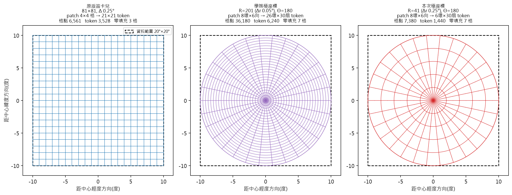
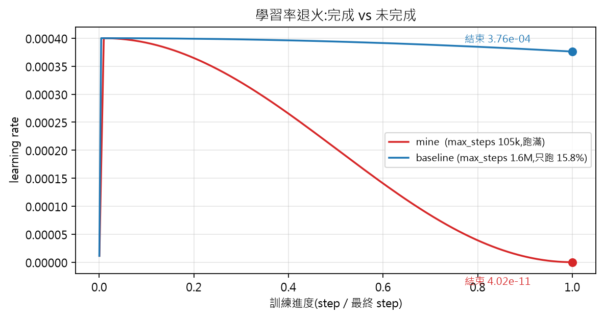
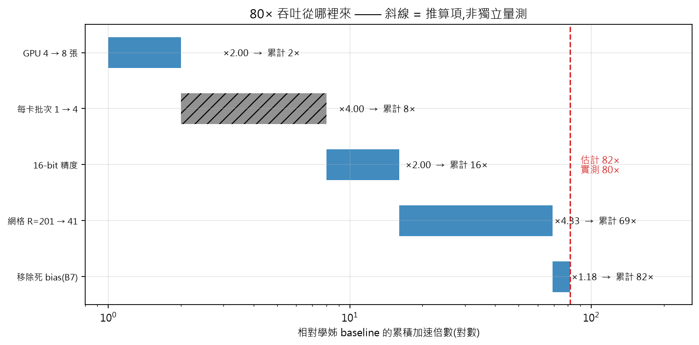
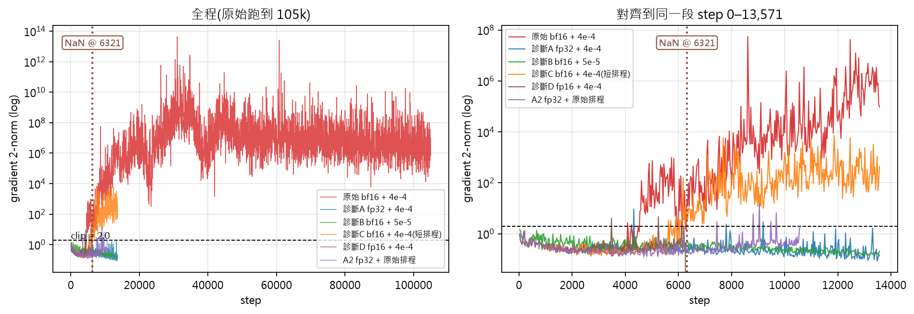
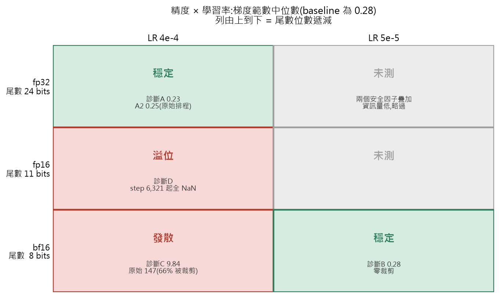
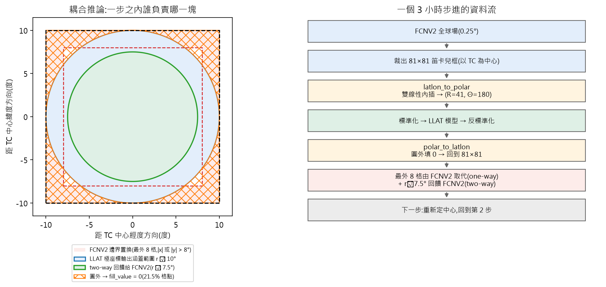
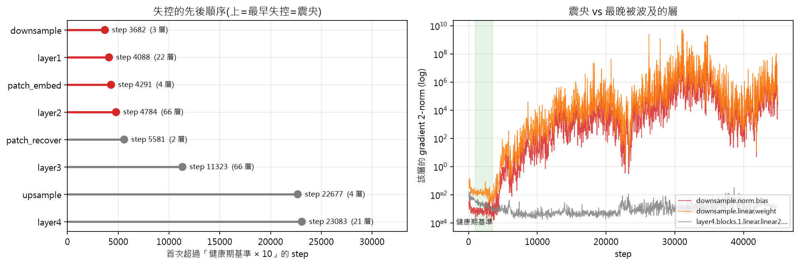
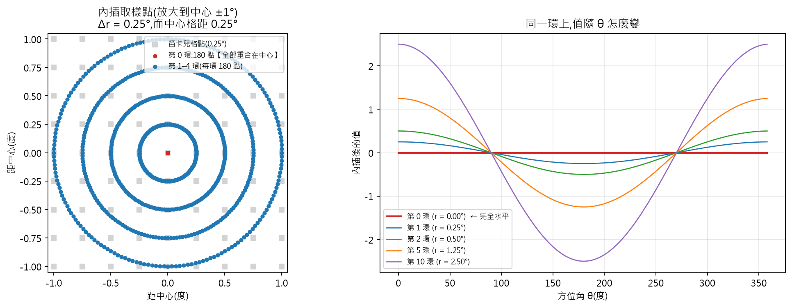
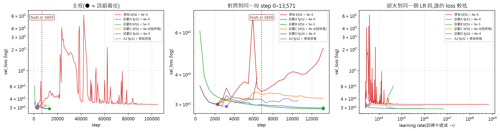

# LLAT.ty 極座標改造

### 進度報告 — 2026-08-05

**目標(老師交代)**

1. **降低運算量**
2. **增加對颱風內核的關注度**

**做法**:把模式從笛卡兒 (lat, lon) 網格改成 **TC 中心極座標 (r, θ)**

**本次報告的三件事**

- 接手學姊的原型,讓它在國網 H200 上**跑得完**
- 找出「值都怪怪的」的**成因**
- 建立**可重現、可歸因**的實驗流程

## 1 · 極座標改了什麼

- **細線 = 一個 token**(transformer 的計算單位)。學姊 6,240 → 本次 **1,440**,**少 4.33×**
- **誠實說明**:相對原版笛卡兒,極座標的**格點數其實多 12%**;token 變少主要來自 patch 從 4×4 放大到 8×6
- 極座標真正的價值:**網格與物理對齊**(vt/vr 直接是切向/徑向風)+ **取樣密度自動集中在內核**

## 2 · 起點:學姊已完成的原型

**已經有的**

- 資料端動態轉極座標、模型可訓練、推論可畫圖 — **不是從零開始**

**兩個現象**

- 訓練**跑不完**就被時限砍斷(4 卡 × 48 小時 × 多段,共 199.6 小時)
- 預報圖**「值都怪怪的」**:最外圈出現 MSLP 423 hPa 這種物理不可能的值(176 格,2.7%)

**我的第一個問題**:是架構不對,還是根本沒訓練完?

## 3 · 診斷①:學習率從未退火

- `max_steps` 設 **1,600,000**,實際只跑到 252,000(**15.8%**)⇒ cosine 只走了開頭
- **訓練結束時學習率仍在峰值的 94%** — 模型從未進入精修階段就被時間砍斷
- 深度學習末段的收斂增益多半來自退火,**這一段完全沒發生**

## 4 · 工程:吞吐提升 80×

- 每 epoch **2.85 小時 → 2.1 分鐘**;牆鐘 199.6 小時 → **6.7 小時**
- 重點不是喊倍數,而是**能拆開、且乘起來對得上**(估計 82× vs 實測 80×)
- **但**:其中「16-bit 精度 2×」後來證實**拿不到**(下一頁)⇒ 真正可保留約 **55×**

## 5 · 診斷②:梯度爆炸

- 同一段 step 內,梯度範數中位數 **0.28 → 147**,**66% 的步驟被裁剪**(健康值 < 1%)
- 裁剪飽和 ⇒ 優化器實際在做**固定步長**更新,**有效學習率由裁剪決定,而非排程**
- 惡化時點極銳利:step 3,999 仍是 0.20,step 4,000–4,999 跳到 2.25

## 6 · 結案:成因是 **16-bit 精度**

- 五組**單變數**短診斷(各 < 1.5 小時)把「一次改五項、無法歸因」拆開
- **兩種 16-bit 從相反方向失敗**:bf16 精度不足 ⇒ 誤差**漸進**累積到 1.1e4;fp16 範圍不足 ⇒ step 6,321 **突然** NaN
- **同時洗清三個嫌疑**:R=41 網格、vt/vr 變數、batch 32 — 診斷 A 具備這三項卻完全健康

## 7 · 推論端:目前還無法產圖

- 極座標圓只涵蓋 **78.5%**,四角 **21.5% 被填 0**,而這些格點**落在 FCNV2 邊界帶內**
- 中心估計是從這個**含零值**的 lon/lat 場算的 ⇒ 可能是 +24h 中心差 350 km 的來源
- 另有 4 個 blocker(ONNX 形狀、變數表、硬編碼 R=201、缺權重)—— 這是下一階段的主要工作

## 8 · 我犯的三個錯

**① 一次改五項** — 變數、網格、精度、批次、`max_steps` 同時動 ⇒ 成因無法歸因

**② 診斷本身又犯同樣的錯** — 為了縮短時間改 `max_steps`,但 cosine 長度來自
`min(每epoch步數 × max_epochs, max_steps)`,**等於同時改了學習率軌跡**。
改用 `max_time` 才修好

**③ 精度選錯是我的判斷失誤** — 改用 bf16 的理由是「避免溢位」,
但原版 LLAT 用 fp16 訓練成功,證明**範圍從來不是瓶頸** — 而 bf16 是三者中精度最差的

**補救**:`OVERLAY` / `RUNDIR` / `FRESH` 三個環境變數,讓每個實驗只記錄差異、各自獨立、可並行

## 9 · 進行中 / 下一步

**正在跑(結果尚未納入本報告)**

| 實驗 | 設定 | 時數 |
|---|---|---|
| 正式訓練 A | bf16 + LR 5e-5,105,000 步 | 6.9 h |
| 正式訓練 B | fp32 + LR 4e-4,96,000 步 | 9.0 h |

**接下來**

- **推論端 4 個 blocker** ⇒ 讓極座標版能產出預報圖
- **`r_min = Δr/2`** 消除中心奇點(訓練端與推論端須同時改)
- **徑向 patch 過粗**:目前 8 格 = 2°,而最大風速半徑僅 0.3–0.5° ⇒ 整個內核落在一個 patch 內
- **空間權重 `w(r) = r^p`** 對治外圈欠約束(⚠️ p 不宜取 1,否則抵銷目標②)

# 附錄 — 問答備用

## A1 · 哪一層先失控

- 對 191 層各取健康期基準,找**首次超過 10 倍**的 step ⇒ 震央是 `DownSample` 的 LayerNorm
- 反向傳播順序是 `layer4 → … → downsample → layer1`,若爆炸來自輸出端,`layer4` 該最先失控 — 實測它**最晚**(差近 20,000 步)
- ⇒ **爆炸在 DownSample 就地產生**。該層健康期梯度僅 0.00056,是全網路最小的幾層之一

## A2 · 為什麼最內環的值全部相同

- `r = linspace(0, r_max, R)` 第一個值是 **0** ⇒ 不論 θ,`(x,y)` 永遠等於中心 ⇒ **180 個方位索引到同一格**
- 用答案已知的合成場驗證:第 0 環標準差 **= 0**,其餘各環振幅正比於 r(內插本身正確)
- **對 vt/vr 特別糟**:切向風的方向定義依賴 θ,常數環是**自相矛盾的目標**

## A3 · 各組實際學到什麼程度

- 梯度看**有沒有壞掉**,損失看**有沒有學好** — 原始那次梯度中位 147(壞了)但 val_loss 仍有 0.30065
- 因為裁剪把每步壓成固定步長,模型仍在往前走,只是方向持續惡化
- `gap`(val − train)全為負 ⇒ **沒有過擬合**;`spike` 次數才是穩定性的直接指標(原始 76 次,健康組 0–2 次)
